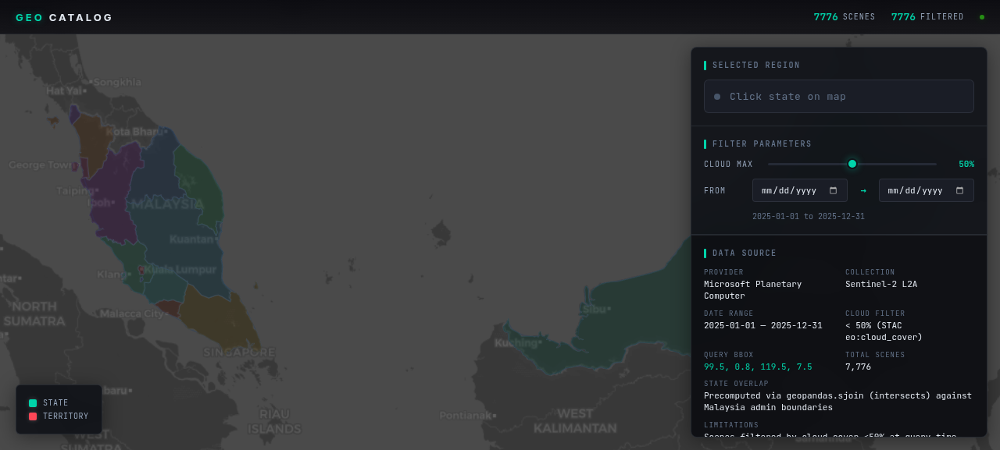

# yazidyaakub.github.io

Personal portfolio site for Mohammad Yazid bin Ag Mohd Yaakub — Geospatial Data Engineer.

## Overview

This is a static HTML/CSS portfolio showcasing projects in geospatial data engineering, 
remote sensing, and data platform development. Built with zero external dependencies 
(no JavaScript frameworks, no Google Fonts, no CDNs).

## Structure

```
.
├── index.html              # Main portfolio page
├── css/
│   └── main.css           # Stylesheet (system fonts, dark theme)
├── assets/
│   └── screenshots/       # Project screenshots (add here)
├── .nojekyll              # Disables Jekyll processing on GitHub Pages
├── .gitignore            # Git ignore rules
└── README.md             # This file
```

## Local Development

### Option 1: Python HTTP Server

```bash
cd ~/yazidyaakub.github.io
python3 -m http.server 8000
```

Then open http://localhost:8000

### Option 2: Node.js (if available)

```bash
cd ~/yazidyaakub.github.io
npx serve
```

### Option 3: VS Code Live Server

Open the folder in VS Code and use the Live Server extension.

## Adding Project Screenshots

1. Take screenshots of your projects (recommended: 1280x800 or 16:10 aspect ratio)
2. Save them to `assets/screenshots/`
3. Update `index.html` to reference the images instead of placeholders

Example:
```html
<div class="project-image">
  
</div>
```

## Adding New Projects

1. Copy an existing project card in `index.html`
2. Update the project name, description, tags, and GitHub link
3. Add a screenshot or keep the placeholder

## Adding Case Study Pages (Future)

1. Create a new HTML file: `projects/case-study-name.html`
2. Link to it from the project card:
   ```html
   <h3><a href="projects/case-study-name.html">Project Name</a></h3>
   ```

## Deployment (When Ready)

This site is configured for GitHub Pages:

1. Push to GitHub as repository `yazidyaakub.github.io`
2. Enable GitHub Pages in repository settings
3. Select source: Deploy from a branch → main → / (root)

## Contact

- Email: yazyyazid@gmail.com
- LinkedIn: https://linkedin.com/in/yazidyaakub
- GitHub: https://github.com/YazidYaakub

---

Built with HTML & CSS. No frameworks, no dependencies.
